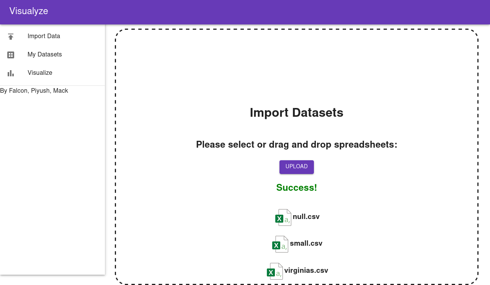
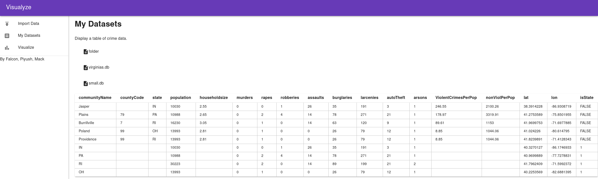
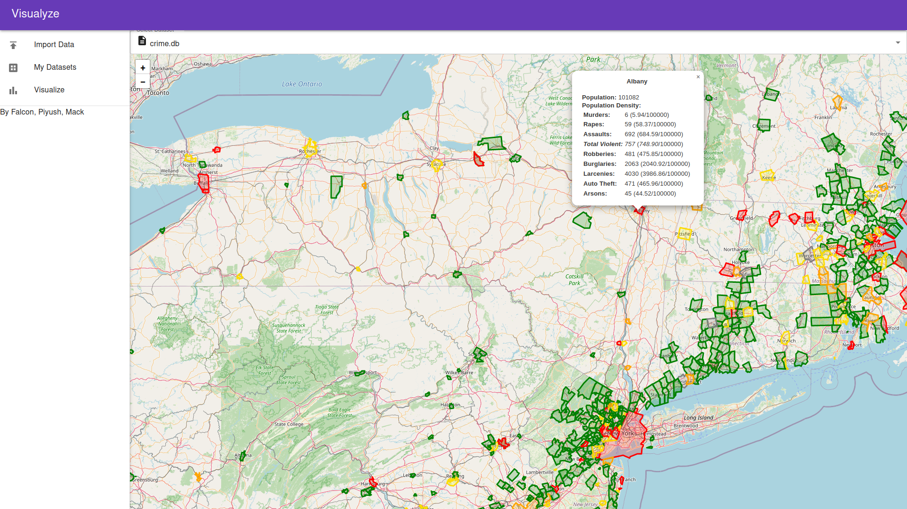
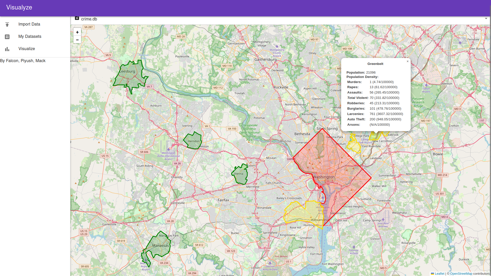
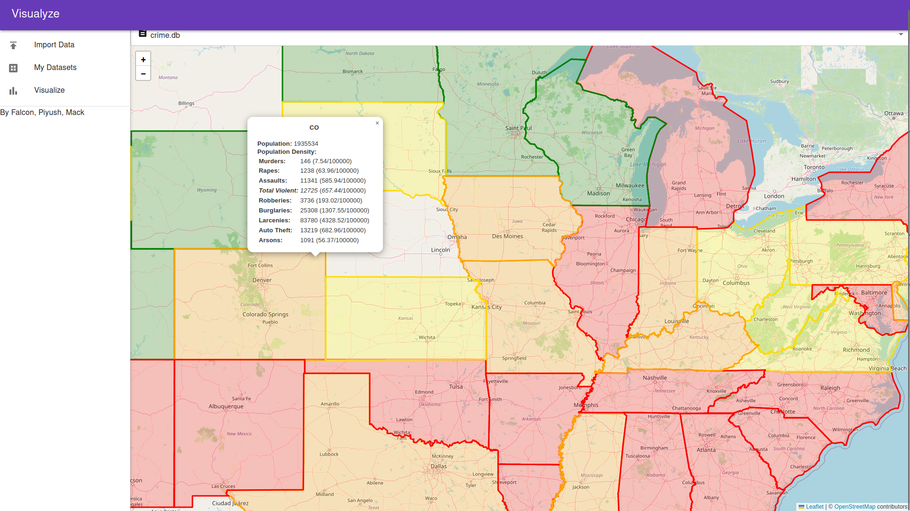
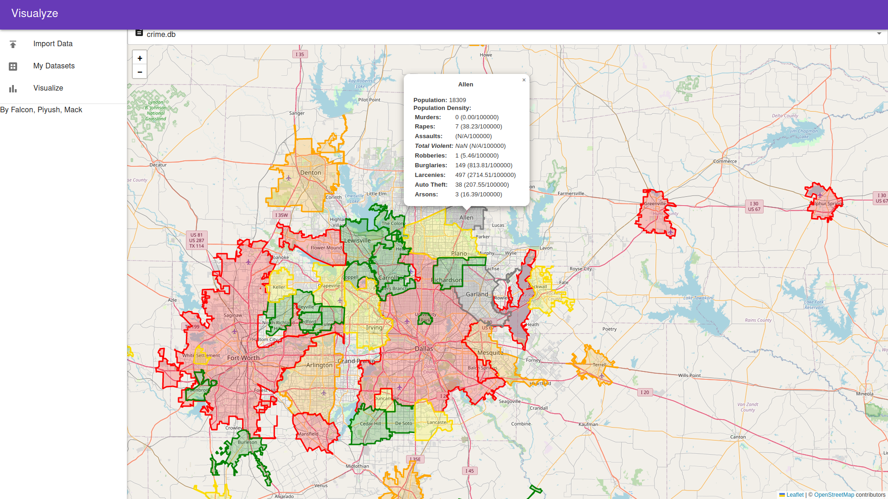

# Introduction to Visualyze CrimeTrack
Our motivation for developing this application is to help people easily visualize crime rates and statistics of municipalities and states in the form of a geographical heat map (choropleth). The application is designed specifically to allow maximum extensibility by utilizing the many field values featured in the database schema. This application is a three-tier application, involving [1] a frontend using React and MUI, [2] a backend using Python and Flask, and [3] a database which is operated by the backend using Sqlite ad GeoJSON.

## Navigation and Prerequisites
To find our **meeting notes**, please see the meeting notes folder.

To find our project development plan and tech stack description, please see **A1.pdf**.

To find our .csv data, please see the **data** folder.

To find our frontend, please see the **crime_database** folder (\*).

To find our backend, please see the **scripts** folder (\*).

To find current issues, please see the **Issues** section of this repo.

This application involves the **Python** language and the **datasette** and **sqlite-utils** packages. Please ensure you have **Python 3** and **Git** installed on your computer before proceeding.

### Structure
The application constitutes a **frontend**, which is a React app, found in the `crime-database` folder extracting and displaying data from .db files, and a **backend**, which is simply a Python Flask application running on Port 3000 found in `/scripts/`. The backend will externally consult from the geocoding API to convert .csv files into database files. All databases are generated by the backend, and are stored in `scripts/db/`.

To run the application correctly, the back end must be run first at **Port 3000**, before the front end. The frontend will fail to reach the backend if the frontend uses Port 3000.

# Startup
The structure of this app makes it very easy to start up, run, and develop. All you need is two command-line terminals (or Python + node.js).

## Cloning
Run the following command in your terminal to clone the repository.
```
git clone https://github.com/philippejlyu/CSC302.git
```

The size of the cloned repository will be more than 80 MB, due to the 50MB size of the `crime.db` sample database (data folder is at 1.6MB). The `node_modules` folder will clock in at 318.4 MB.

## Running on Docker
Navigate to the root directory of the cloned repository locally (folder named `CSC302`) and execute the following command in your terminal to run the application in a browser window. The pip packages will be installed by this shell file in addition to running the webserver.

Precondition: Docker must be installed on your computer. You may need to use sudo if you are running on Linux. The Docker image will be at least 2GB in total, and 1493 npm packages are utilized. There are six high security vulnerabilities.

```
docker build .
docker run -p 3000:3000 <image SHA>
```

## Example run build
An example run should look like (the SHA is `3b2061d454a2` in this run)

<details><summary>Click for Runthrough</summary>

```
mulliganaceous@MULLIGANACEOUS2:~/Documents/Heathencastle/4F/CSC302/CrimeTracker$ sudo docker build .
[sudo] password for mulliganaceous: 
Sending build context to Docker daemon  850.4MB
Step 1/14 : FROM python:3.9-bullseye
 ---> 850f8694d221
Step 2/14 : WORKDIR /usr/app
 ---> Using cache
 ---> 40f84d7eb2cf
Step 3/14 : RUN pip3 install Flask
 ---> Using cache
 ---> 4cc3078ca0d4
Step 4/14 : RUN curl -fsSL https://deb.nodesource.com/setup_18.x | bash -
 ---> Using cache
 ---> 5128c95f48b4
Step 5/14 : RUN apt-get update
 ---> Using cache
 ---> bbfef4509b96
Step 6/14 : RUN apt-get install -y nodejs
 ---> Using cache
 ---> dfe8b9114f45
Step 7/14 : RUN pip install Flask-Cors
 ---> Using cache
 ---> 1b4b57f5a355
Step 8/14 : COPY ./scripts .
 ---> 80252a4b30d2
Step 9/14 : COPY ./data .
 ---> a890cc61443f
Step 10/14 : COPY crime_database .
 ---> 5c8946daf343
Step 11/14 : RUN npm install
 ---> Running in a013eb63a257

up to date, audited 1669 packages in 6s

236 packages are looking for funding
  run `npm fund` for details

6 high severity vulnerabilities

To address all issues (including breaking changes), run:
  npm audit fix --force

Run `npm audit` for details.
npm notice 
npm notice New major version of npm available! 8.19.2 -> 9.2.0
npm notice Changelog: <https://github.com/npm/cli/releases/tag/v9.2.0>
npm notice Run `npm install -g npm@9.2.0` to update!
npm notice 
Removing intermediate container a013eb63a257
 ---> 1338abc0311b
Step 12/14 : RUN npm run build
 ---> Running in 3544f4e1ca59

> crime_database@0.1.0 build
> react-scripts build

Creating an optimized production build...
Compiled with warnings.
…

File sizes after gzip:

  193.95 kB  build/static/js/main.5d4c97bc.js
  6.8 kB     build/static/css/main.ae606f91.css
  1.79 kB    build/static/js/787.fc06b3ca.chunk.js

The project was built assuming it is hosted at /.
You can control this with the homepage field in your package.json.

The build folder is ready to be deployed.
You may serve it with a static server:

  npm install -g serve
  serve -s build

Find out more about deployment here:

  https://cra.link/deployment

Removing intermediate container 3544f4e1ca59
 ---> 113accf4034a
Step 13/14 : RUN pip3 install -r ./requirements.txt
 ---> Running in 9bf12e2e0869
Collecting datasette
  Downloading datasette-0.63.2-py3-none-any.whl (231 kB)
     ━━━━━━━━━━━━━━━━━━━━━━━━━━━━━━━━━━━━━━━ 231.9/231.9 KB 2.3 MB/s eta 0:00:00
Collecting sqlite-utils
  Downloading sqlite_utils-3.30-py3-none-any.whl (63 kB)
     ━━━━━━━━━━━━━━━━━━━━━━━━━━━━━━━━━━━━━━━━ 63.8/63.8 KB 1.3 MB/s eta 0:00:00
Requirement already satisfied: Flask in /usr/local/lib/python3.9/site-packages (from -r ./requirements.txt (line 3)) (2.2.2)
Collecting requests
  Downloading requests-2.28.1-py3-none-any.whl (62 kB)
     ━━━━━━━━━━━━━━━━━━━━━━━━━━━━━━━━━━━━━━━━ 62.8/62.8 KB 1.1 MB/s eta 0:00:00
Collecting pandas
  Downloading pandas-1.5.2-cp39-cp39-manylinux_2_17_x86_64.manylinux2014_x86_64.whl (12.2 MB)
     ━━━━━━━━━━━━━━━━━━━━━━━━━━━━━━━━━━━━━━━━ 12.2/12.2 MB 5.2 MB/s eta 0:00:00
Collecting openpyxl
  Downloading openpyxl-3.0.10-py2.py3-none-any.whl (242 kB)
     ━━━━━━━━━━━━━━━━━━━━━━━━━━━━━━━━━━━━━━━ 242.1/242.1 KB 2.5 MB/s eta 0:00:00
Collecting PyYAML>=5.3
  Downloading PyYAML-6.0-cp39-cp39-manylinux_2_5_x86_64.manylinux1_x86_64.manylinux_2_12_x86_64.manylinux2010_x86_64.whl (661 kB)
     ━━━━━━━━━━━━━━━━━━━━━━━━━━━━━━━━━━━━━━━ 661.8/661.8 KB 3.9 MB/s eta 0:00:00
Collecting uvicorn>=0.11
  Downloading uvicorn-0.20.0-py3-none-any.whl (56 kB)
     ━━━━━━━━━━━━━━━━━━━━━━━━━━━━━━━━━━━━━━━ 56.9/56.9 KB 930.6 kB/s eta 0:00:00
Collecting pint>=0.9
  Downloading Pint-0.20.1-py3-none-any.whl (269 kB)
     ━━━━━━━━━━━━━━━━━━━━━━━━━━━━━━━━━━━━━━━ 269.5/269.5 KB 2.6 MB/s eta 0:00:00
Collecting pluggy>=1.0
  Downloading pluggy-1.0.0-py2.py3-none-any.whl (13 kB)
Collecting mergedeep>=1.1.1
  Downloading mergedeep-1.3.4-py3-none-any.whl (6.4 kB)
Collecting asgi-csrf>=0.9
  Downloading asgi_csrf-0.9-py3-none-any.whl (10 kB)
Requirement already satisfied: itsdangerous>=1.1 in /usr/local/lib/python3.9/site-packages (from datasette->-r ./requirements.txt (line 1)) (2.1.2)
Collecting janus>=0.6.2
  Downloading janus-1.0.0-py3-none-any.whl (6.9 kB)
Requirement already satisfied: Jinja2>=2.10.3 in /usr/local/lib/python3.9/site-packages (from datasette->-r ./requirements.txt (line 1)) (3.1.2)
Collecting asgiref>=3.2.10
  Downloading asgiref-3.5.2-py3-none-any.whl (22 kB)
Collecting httpx>=0.20
  Downloading httpx-0.23.1-py3-none-any.whl (84 kB)
     ━━━━━━━━━━━━━━━━━━━━━━━━━━━━━━━━━━━━━━━━ 85.0/85.0 KB 1.4 MB/s eta 0:00:00
Collecting click-default-group-wheel>=1.2.2
  Downloading click_default_group_wheel-1.2.2-py3-none-any.whl (3.9 kB)
Requirement already satisfied: click>=7.1.1 in /usr/local/lib/python3.9/site-packages (from datasette->-r ./requirements.txt (line 1)) (8.1.3)
Collecting hupper>=1.9
  Downloading hupper-1.10.3-py2.py3-none-any.whl (26 kB)
Collecting aiofiles>=0.4
  Downloading aiofiles-22.1.0-py3-none-any.whl (14 kB)
Collecting python-dateutil
  Downloading python_dateutil-2.8.2-py2.py3-none-any.whl (247 kB)
     ━━━━━━━━━━━━━━━━━━━━━━━━━━━━━━━━━━━━━━━ 247.7/247.7 KB 3.0 MB/s eta 0:00:00
Collecting tabulate
  Downloading tabulate-0.9.0-py3-none-any.whl (35 kB)
Collecting sqlite-fts4
  Downloading sqlite_fts4-1.0.3-py3-none-any.whl (10.0 kB)
Requirement already satisfied: importlib-metadata>=3.6.0 in /usr/local/lib/python3.9/site-packages (from Flask->-r ./requirements.txt (line 3)) (5.1.0)
Requirement already satisfied: Werkzeug>=2.2.2 in /usr/local/lib/python3.9/site-packages (from Flask->-r ./requirements.txt (line 3)) (2.2.2)
Collecting certifi>=2017.4.17
  Downloading certifi-2022.12.7-py3-none-any.whl (155 kB)
     ━━━━━━━━━━━━━━━━━━━━━━━━━━━━━━━━━━━━━━━ 155.3/155.3 KB 2.7 MB/s eta 0:00:00
Collecting idna<4,>=2.5
  Downloading idna-3.4-py3-none-any.whl (61 kB)
     ━━━━━━━━━━━━━━━━━━━━━━━━━━━━━━━━━━━━━━━━ 61.5/61.5 KB 1.3 MB/s eta 0:00:00
Collecting charset-normalizer<3,>=2
  Downloading charset_normalizer-2.1.1-py3-none-any.whl (39 kB)
Collecting urllib3<1.27,>=1.21.1
  Downloading urllib3-1.26.13-py2.py3-none-any.whl (140 kB)
     ━━━━━━━━━━━━━━━━━━━━━━━━━━━━━━━━━━━━━━━ 140.6/140.6 KB 2.3 MB/s eta 0:00:00
Collecting pytz>=2020.1
  Downloading pytz-2022.6-py2.py3-none-any.whl (498 kB)
     ━━━━━━━━━━━━━━━━━━━━━━━━━━━━━━━━━━━━━━━ 498.1/498.1 KB 4.2 MB/s eta 0:00:00
Collecting numpy>=1.20.3
  Downloading numpy-1.23.5-cp39-cp39-manylinux_2_17_x86_64.manylinux2014_x86_64.whl (17.1 MB)
     ━━━━━━━━━━━━━━━━━━━━━━━━━━━━━━━━━━━━━━━━ 17.1/17.1 MB 4.6 MB/s eta 0:00:00
Collecting et-xmlfile
  Downloading et_xmlfile-1.1.0-py3-none-any.whl (4.7 kB)
Collecting python-multipart
  Downloading python-multipart-0.0.5.tar.gz (32 kB)
  Preparing metadata (setup.py): started
  Preparing metadata (setup.py): finished with status 'done'
Collecting httpcore<0.17.0,>=0.15.0
  Downloading httpcore-0.16.2-py3-none-any.whl (68 kB)
     ━━━━━━━━━━━━━━━━━━━━━━━━━━━━━━━━━━━━━━━━ 69.0/69.0 KB 1.0 MB/s eta 0:00:00
Collecting sniffio
  Downloading sniffio-1.3.0-py3-none-any.whl (10 kB)
Collecting rfc3986[idna2008]<2,>=1.3
  Downloading rfc3986-1.5.0-py2.py3-none-any.whl (31 kB)
Requirement already satisfied: zipp>=0.5 in /usr/local/lib/python3.9/site-packages (from importlib-metadata>=3.6.0->Flask->-r ./requirements.txt (line 3)) (3.11.0)
Collecting typing-extensions>=3.7.4.3
  Downloading typing_extensions-4.4.0-py3-none-any.whl (26 kB)
Requirement already satisfied: MarkupSafe>=2.0 in /usr/local/lib/python3.9/site-packages (from Jinja2>=2.10.3->datasette->-r ./requirements.txt (line 1)) (2.1.1)
Requirement already satisfied: six>=1.5 in /usr/local/lib/python3.9/site-packages (from python-dateutil->sqlite-utils->-r ./requirements.txt (line 2)) (1.16.0)
Collecting h11>=0.8
  Downloading h11-0.14.0-py3-none-any.whl (58 kB)
     ━━━━━━━━━━━━━━━━━━━━━━━━━━━━━━━━━━━━━━━━ 58.3/58.3 KB 1.1 MB/s eta 0:00:00
Collecting anyio<5.0,>=3.0
  Downloading anyio-3.6.2-py3-none-any.whl (80 kB)
     ━━━━━━━━━━━━━━━━━━━━━━━━━━━━━━━━━━━━━━━━ 80.6/80.6 KB 1.5 MB/s eta 0:00:00
Building wheels for collected packages: python-multipart
  Building wheel for python-multipart (setup.py): started
  Building wheel for python-multipart (setup.py): finished with status 'done'
  Created wheel for python-multipart: filename=python_multipart-0.0.5-py3-none-any.whl size=31678 sha256=897c5a5dd92a40959d33afdd07743e367462af1eb5bbb386da24905fab8d71d6
  Stored in directory: /root/.cache/pip/wheels/fe/04/d1/a10661cc45f03c3cecda50deb2d2c22f57b4e84a75b2a5987e
Successfully built python-multipart
Installing collected packages: sqlite-fts4, rfc3986, pytz, urllib3, typing-extensions, tabulate, sniffio, PyYAML, python-multipart, python-dateutil, pluggy, pint, numpy, mergedeep, idna, hupper, h11, et-xmlfile, click-default-group-wheel, charset-normalizer, certifi, asgiref, aiofiles, uvicorn, sqlite-utils, requests, pandas, openpyxl, janus, asgi-csrf, anyio, httpcore, httpx, datasette
Successfully installed PyYAML-6.0 aiofiles-22.1.0 anyio-3.6.2 asgi-csrf-0.9 asgiref-3.5.2 certifi-2022.12.7 charset-normalizer-2.1.1 click-default-group-wheel-1.2.2 datasette-0.63.2 et-xmlfile-1.1.0 h11-0.14.0 httpcore-0.16.2 httpx-0.23.1 hupper-1.10.3 idna-3.4 janus-1.0.0 mergedeep-1.3.4 numpy-1.23.5 openpyxl-3.0.10 pandas-1.5.2 pint-0.20.1 pluggy-1.0.0 python-dateutil-2.8.2 python-multipart-0.0.5 pytz-2022.6 requests-2.28.1 rfc3986-1.5.0 sniffio-1.3.0 sqlite-fts4-1.0.3 sqlite-utils-3.30 tabulate-0.9.0 typing-extensions-4.4.0 urllib3-1.26.13 uvicorn-0.20.0
    WARNING: Running pip as the 'root' user can result in broken permissions and conflicting behaviour with the system package manager. It is recommended to use a virtual environment instead: https://pip.pypa.io/warnings/venv
    WARNING: You are using pip version 22.0.4; however, version 22.3.1 is available.
    You should consider upgrading via the '/usr/local/bin/python -m pip install --upgrade pip' command.
Removing intermediate container 9bf12e2e0869
 ---> 6b14dab7e5d3
Step 14/14 : CMD ["python3", "flask_main.py"]
 ---> Running in c0fcb81b43c2
Removing intermediate container c0fcb81b43c2
 ---> 3b2061d454a2
Successfully built 3b2061d454a2

Use 'docker scan' to run Snyk tests against images to find vulnerabilities and learn how to fix them
```
</details>

## Example runthrough
<details><summary>Click for Runthrough</summary>

```
$ docker run -p 3000:3000 3b2061d454a2
The App static folder is /usr/app/build
 * Serving Flask app 'flask_main'
 * Debug mode: on
WARNING: This is a development server. Do not use it in a production deployment. Use a production WSGI server instead.
 * Running on all addresses (0.0.0.0)
 * Running on http://127.0.0.1:3000
 * Running on http://172.17.0.2:3000
Press CTRL+C to quit
 * Restarting with stat
 * Debugger is active!
 * Debugger PIN: 373-535-545
172.17.0.1 - - [10/Dec/2022 13:07:03] "GET / HTTP/1.1" 200 -
172.17.0.1 - - [10/Dec/2022 13:07:03] "GET /static/js/main.5d4c97bc.js HTTP/1.1" 200 -
172.17.0.1 - - [10/Dec/2022 13:07:03] "GET /static/css/main.ae606f91.css HTTP/1.1" 200 -
172.17.0.1 - - [10/Dec/2022 13:07:04] "GET /32.ico HTTP/1.1" 200 -
172.17.0.1 - - [10/Dec/2022 13:07:04] "GET /512.png HTTP/1.1" 200 -
172.17.0.1 - - [10/Dec/2022 13:07:05] "GET /mapData HTTP/1.1" 200 -
172.17.0.1 - - [10/Dec/2022 13:07:08] "GET /mapData?allLevel&datasetID=crime.db HTTP/1.1" 200 -
172.17.0.1 - - [10/Dec/2022 13:07:15] "GET /mapData?allLevel&datasetID=virginias_null.db HTTP/1.1" 200 -
172.17.0.1 - - [10/Dec/2022 13:07:16] "GET /mapData?allLevel&datasetID=nullcrime.db HTTP/1.1" 200 -
172.17.0.1 - - [10/Dec/2022 13:07:17] "GET /mapData?allLevel&datasetID=small.db HTTP/1.1" 200 -
172.17.0.1 - - [10/Dec/2022 13:07:18] "GET /mapData HTTP/1.1" 200 -
172.17.0.1 - - [10/Dec/2022 13:07:22] "GET /mapData?datasetID=crime.db HTTP/1.1" 200 -
172.17.0.1 - - [10/Dec/2022 13:07:41] "GET /mapData?stateLevel&datasetID=crime.db HTTP/1.1" 200 -
172.17.0.1 - - [10/Dec/2022 13:07:53] "GET /mapData HTTP/1.1" 200 -
172.17.0.1 - - [10/Dec/2022 13:07:55] "GET /mapData?allLevel&datasetID=small.db HTTP/1.1" 200 -
172.17.0.1 - - [10/Dec/2022 13:07:58] "GET /mapData?allLevel&datasetID=crimedata_corruptisstate.db HTTP/1.1" 200 -
172.17.0.1 - - [10/Dec/2022 13:08:08] "GET /mapData?allLevel&datasetID=nullcrime.db HTTP/1.1" 200 -
172.17.0.1 - - [10/Dec/2022 13:08:11] "GET /mapData?allLevel&datasetID=virginias_reduced.db HTTP/1.1" 200 -
172.17.0.1 - - [10/Dec/2022 13:08:13] "GET /mapData?allLevel&datasetID=blank.db HTTP/1.1" 418 - (Blank db)
172.17.0.1 - - [10/Dec/2022 13:08:14] "GET /mapData?allLevel&datasetID=folder HTTP/1.1" 500 - (opening folder still yields 500; does not happen in normal runs)
    Traceback (most recent call last):
    …
    sqlite3.OperationalError: unable to open database file
172.17.0.1 - - [10/Dec/2022 13:08:15] "GET /mapData?allLevel&datasetID=virginias_null.db HTTP/1.1" 200 -
172.17.0.1 - - [10/Dec/2022 13:08:16] "GET /mapData?allLevel&datasetID=folder HTTP/1.1" 500 - (opening folder still yields 500; does not happen in normal runs)
    Traceback (most recent call last):
    …
    sqlite3.OperationalError: unable to open database file

172.17.0.1 - - [10/Dec/2022 13:08:55] "POST /upload HTTP/1.1" 200 -

172.17.0.1 - - [10/Dec/2022 13:09:08] "POST /upload HTTP/1.1" 500 - (Corrupt CSV with missing LandArea column)
    Traceback (most recent call last):
    …
    sqlite3.OperationalError: no such column: LandArea
172.17.0.1 - - [10/Dec/2022 13:09:10] "GET /static/js/main.5d4c97bc.js.map HTTP/1.1" 200 -

172.17.0.1 - - [10/Dec/2022 13:10:11] "POST /upload HTTP/1.1" 500 - (Corrupt CSV with missing LandArea column)
    Traceback (most recent call last):
    …
    sqlite3.OperationalError: no such column: communityName

172.17.0.1 - - [10/Dec/2022 13:11:47] "POST /upload HTTP/1.1" 200 -

```
</details>

The application can be found at `localhost:3000`.


## Starting the Backend (debug)
Navigate to the backend folder, `$BACKEND`, which is currently `/scripts/`. After having the required Python modules installed, as outlined in `requirements.txt`, simply run

```
python3 flask_main.py
```

## Starting the Frontend (debug)
Navigate to the frontend folder, `$FRONTEND`, which is currently `/crime_database`. Perform NPM install and build via

```
npm i
npm run build
```

After the application was build, simply run
```
npm run start
```

# Uploading new datasets
Datasets will be uploaded on the main page of this app. You can upload files by drag-and-drop or clicking the **Upload** button. All datasets uploaded will be a .csv or .xlsx file structured in the following way:
* Header must contain the column names as according to the `data/crimedata.csv` file. There are **146** different fields, some of them mandatory.
* Entries must be identified by their community name and state.

Our dataset schema is decided based on a [**single Kaggle** dataset](https://www.kaggle.com/datasets/michaelbryantds/crimedata) by Michael Bryant. This dataset contains 146 different fields, but only a few of them are actively involved in the backend, while extraneous fields are here for future expansions. Sqlite will add four more different fields, in which it will use the community name and state information to obtain geographical boundaries as a Polygon, and then add a flag stating whether it is city-level or state-level.

It is important that some fields, such as the community name, state, population, land area, and important percentage-based datasets be not null to avoid complications from the backend and frontend. Concessions have to be made should an anomalous entry be entered.



## Data prerequisites
Community name is formatted with **no spaces**. Instead of spaces, have a capital letter denoting the space ending with the city type.
* For example, Los Angeles would be `LosAngelescity`
* Community name needs to be a valid city that can be searchable by open street map
* Commuinty name needs to be a valid city with geographical boundaries regonzied by open street map

## Process
Upon dragging the files, they will be sent to the backend via `http://localhost:3000/upload`. The backend will process each row, using the `CommunityName` and `State` values to obtain the polygons and coordinates of this municipality. The rows will be stored in the newly created `locations` table of the corresponding `.db` file stored in the `$BACKEND/db/` folder.

The status will say *Uploading* when there is a pending upload in progress, *Success* when all uploads are successful, and *Error* in case any of the uploads are not successful.

## Temporarily Restrictions
* There is a rate limit of 1 per second for our geocoding api. Large datasets may take hours to process.
* City needs to be within the USA and each must have a state associated with it. Territories such as Puerto Rico, Guam etc will not work.
* Cities with unknown regions will be treated as valid, but will not have an associated polygon.
    * Thus, in Visualization, the console will log `Error processing mapdata information: $CommunityName ; 0 ; 0 ; [[]]`.
    * There will be no abnormal return status. However, the offending city will not be visible on the map.
* Corrupt datasets and files not of a given format will be handled accordingly with a `418 TEAPOT` response.
    * Corrupt datasets can be noted by the warning log `Error: Response not of correct format: Response does not have rows field`.
    * This can be reflected on the **Network** tab on F12, in which the exact reason can be spotted.
    * It is possible for a .db to work normally on My Datasets, but regarded as corrupt on Visualize.
    * An example is `crimedata_corruptisstate.db`, in which the requets fails due to lacking the `isState` flag only used in the Visualization tab.
    * All non-db files are removed upon performing upload.
* It is currently a hassle to manually input all the data into a CSV.

# My Datasets
The user is able to view all of the data after selecting or reselecting the databases processed and stored on the backend. The most important data are shown on the table, further data can be seen by hovering over the community name.

The displayed data is derived from the response after calling `http://localhost:3000/mapData?allLevel&datasetID=$DBNAME` where `$DBNAME` is the name of the database file as found in `$BACKEND/db/`. The response will be a collection of **rows**, where each row is a JSON object containing attributes corresponding to the column names found in the `locations` table of that `.db` file.

If the `.db` file is not of the correct format, such as lacking the `locations` table, or being a folder, a 418 TEAPOT response will be sent by the backend.



## Temporarily Restrictions
* The UX experience for viewing all the data is currently suboptimal
    * With 150 fields, the tooltip may overflow
* Sorting and showing/hiding column are currently not supported
* The entire table will be loaded, making the experience slow for large datasets
* The fetch will always fail and return a HTTP 300 if the `db` file contains only whitespaces, or is named `"null"`.
* All files on the `db` folder will be listed. Currently, the backend glitches, sends out 500, but refuses to process anyways when a folder is used.

# Visualize
The capstone of our project. The user is provided a map, implemented in React Leaflet. After selecting a file, the app will load the polygons to provide a crime frequency choropleth. A dropdown is provided at the top to filter the visualizations; a backend fetch is done each time you change the dataset.

The map visualization is implemented in **React Leaflet**, the **React** implementation of a popular open-source JS mapping library. The `<Map>` component will take in the name of the dataset as a prop, and consequently perform the fetch, to load the (multi)polygons for each city. It then color-codes each polygon depending on the calculated overall crime rate. You can click on each polygon to view the exact population and crime statistics, including the overall number of violent crimes committed in this region.

## Current coloring scheme
There are currently eight categories of crime. A formula is used to determine the color category.

The coloring is determined by number of crimes per 100,000
* `< 300`: Green
* `< 500`: Yellow
* `< 700`: Orange
* `> 700`: Red


<details><summary>Click for more screenshots</summary>




</details>

## Temporarily Restrictions
* Visualization can be very slow if the dataset is very large containing thousands of cities.
* We have not implemented a feature to dynamically load cities when the polygons are in range.
* We haven't customized the colors yet. They are hard coded in some form.

# Feature delivery
As per our Assignment 1 deliverable, we planned to have the following functionality completed by Assignemnt 3

1. Method to import data into the SQLite database
2. Have a react frontend
3. Create a backend that serves the frontend and its associated data
4. Support different types of visualizations
5. Allow users to import similarly formatted datasets

Goal 1-4 have been met according to the following acceptance criteria
1. Input the dataset from kaggle and be able to run SQL commands on it
2. Have a basic website that displays our dataset
3. Have a backend that serves valid data to the frontend
4. Have 2 or more kinds of visualizations. Map view, my datasets view, map popup view

Goal 5 partially met what we desired.
For goal 5, our goal was to allow the user to input a dataset with the same column names, but allow them to be missing a few non-important columns. As of now, this is not possible, however we do allow the user to input identically formatted datsets.

# Testing
* Use F12 to check logging and frontend testing status.
    * Errors are logged as warnings on the console
    * Nonimplementation issuese are logged as errors, hinting further development.
    * There are several .db files already present on the `$BACKEND/db` folder and .csv files present on the `/notes/` folder; some of them deliberately anomalous to trigger exception-handling behavior.
* Backend tests are verified by GitHub actions.
    * They are to ensure backend operations match those as obtaining data through conventional .xlsx method.   
    * Rearranging the fields is OK, but removing columns might not be OK
* Various datasets, including those with anomalous data, have been provided for testing purposes and verifyin that the application handles anomalies correctly.
    * A reference of the 150 fields is provided below.
    * More example anomalies are listed on the following section.
* JS Tests: When compiling the docker container, our JS compilation test runs to ensure that our frontend can be successfully compiled

To run unit tests, attach an interactive shell to the previously built docker repository.
To do that, run the following command
```
docker run -it <container sha> bash
```
To run our testing, run the following shell script
```
./run_tests.sh
```
## Code linting
A code linter runs on GitHub Actions to ensure that our code meets industry standards

## The 150 fields
| Order  | Field             | Notes
|--------|-------------------|----------
| 0 	 | communityName	 | Mandatory, identifier for GeoJSON
| 1 	 | state	 |         Mandatory, identifier for GeoJSON
| 2 	 | countyCode	 |     
| 3 	 | communityCode	 | 
| 4 	 | population	 |     Used in state-level data as of A3
| 5 	 | householdsize	 | 
| 6 	 | racepctblack	 |     Used in state-level data as of A3
| 7 	 | racePctWhite	 |     Used in state-level data as of A3
| 8 	 | racePctAsian	 |     Used in state-level data as of A3
| 9 	 | racePctHisp	 |     Used in state-level data as of A3
| 10 	 | agePct12t21	 |     Used in state-level data as of A3
| 11 	 | agePct12t29	 |     Used in state-level data as of A3
| 12 	 | agePct16t24	 |     Used in state-level data as of A3
| 13 	 | agePct65up	 |     Used in state-level data as of A3
| 14 	 | numbUrban	 | 
| 15 	 | pctUrban	 | 
| 16 	 | medIncome	 | 
| 17 	 | pctWWage	 | 
| 18 	 | pctWFarmSelf	 | 
| 19 	 | pctWInvInc	 | 
| 20 	 | pctWSocSec	 | 
| 21 	 | pctWPubAsst	 | 
| 22 	 | pctWRetire	 | 
| 23 	 | medFamInc	 | 
| 24 	 | perCapInc	 | 
| 25 	 | whitePerCap	 | 
| 26 	 | blackPerCap	 | 
| 27 	 | indianPerCap	 | 
| 28 	 | AsianPerCap	 | 
| 29 	 | OtherPerCap	 | 
| 30 	 | HispPerCap	 | 
| 31 	 | NumUnderPov	 | 
| 32 	 | PctPopUnderPov	 | 
| 33 	 | PctLess9thGrade	 | 
| 34 	 | PctNotHSGrad	 | 
| 35 	 | PctBSorMore	 | 
| 36 	 | PctUnemployed	 | 
| 37 	 | PctEmploy	 | 
| 38 	 | PctEmplManu	 | 
| 39 	 | PctEmplProfServ	 | 
| 40 	 | PctOccupManu	 | 
| 41 	 | PctOccupMgmtProf	 | 
| 42 	 | MalePctDivorce	 | 
| 43 	 | MalePctNevMarr	 | 
| 44 	 | FemalePctDiv	 | 
| 45 	 | TotalPctDiv	 | 
| 46 	 | PersPerFam	 | 
| 47 	 | PctFam2Par	 | 
| 48 	 | PctKids2Par	 | 
| 49 	 | PctYoungKids2Par	 | 
| 50 	 | PctTeen2Par	 | 
| 51 	 | PctWorkMomYoungKids	 | 
| 52 	 | PctWorkMom	 | 
| 53 	 | NumKidsBornNeverMar	 | 
| 54 	 | PctKidsBornNeverMar	 | 
| 55 	 | NumImmig	 | 
| 56 	 | PctImmigRecent	 | 
| 57 	 | PctImmigRec5	 | 
| 58 	 | PctImmigRec8	 | 
| 59 	 | PctImmigRec10	 | 
| 60 	 | PctRecentImmig	 | 
| 61 	 | PctRecImmig5	 | 
| 62 	 | PctRecImmig8	 | 
| 63 	 | PctRecImmig10	 | 
| 64 	 | PctSpeakEnglOnly	 | 
| 65 	 | PctNotSpeakEnglWell	 | 
| 66 	 | PctLargHouseFam	 | 
| 67 	 | PctLargHouseOccup	 | 
| 68 	 | PersPerOccupHous	 | 
| 69 	 | PersPerOwnOccHous	 | 
| 70 	 | PersPerRentOccHous	 | 
| 71 	 | PctPersOwnOccup	 | 
| 72 	 | PctPersDenseHous	 | 
| 73 	 | PctHousLess3BR	 | 
| 74 	 | MedNumBR	 | 
| 75 	 | HousVacant	 | 
| 76 	 | PctHousOccup	 | 
| 77 	 | PctHousOwnOcc	 | 
| 78 	 | PctVacantBoarded	 | 
| 79 	 | PctVacMore6Mos	 | 
| 80 	 | MedYrHousBuilt	 | 
| 81 	 | PctHousNoPhone	 | 
| 82 	 | PctWOFullPlumb	 | 
| 83 	 | OwnOccLowQuart	 | 
| 84 	 | OwnOccMedVal	 | 
| 85 	 | OwnOccHiQuart	 | 
| 86 	 | OwnOccQrange	 | 
| 87 	 | RentLowQ	 | 
| 88 	 | RentMedian	 | 
| 89 	 | RentHighQ	 | 
| 90 	 | RentQrange	 | 
| 91 	 | MedRent	 | 
| 92 	 | MedRentPctHousInc	 | 
| 93 	 | MedOwnCostPctInc	 | 
| 94 	 | MedOwnCostPctIncNoMtg	 | 
| 95 	 | NumInShelters	 | 
| 96 	 | NumStreet	 | 
| 97 	 | PctForeignBorn	 | 
| 98 	 | PctBornSameState	 | 
| 99 	 | PctSameHouse85	 | 
| 100 	 | PctSameCity85	 | 
| 101 	 | PctSameState85	 | 
| 102 	 | LemasSwornFT	 | 
| 103 	 | LemasSwFTPerPop	 | 
| 104 	 | LemasSwFTFieldOps	 | 
| 105 	 | LemasSwFTFieldPerPop	 | 
| 106 	 | LemasTotalReq	 | 
| 107 	 | LemasTotReqPerPop	 | 
| 108 	 | PolicReqPerOffic	 | 
| 109 	 | PolicPerPop	 | 
| 110 	 | RacialMatchCommPol	 | 
| 111 	 | PctPolicWhite	 | 
| 112 	 | PctPolicBlack	 | 
| 113 	 | PctPolicHisp	 | 
| 114 	 | PctPolicAsian	 | 
| 115 	 | PctPolicMinor	 | 
| 116 	 | OfficAssgnDrugUnits	 | 
| 117 	 | NumKindsDrugsSeiz	 | 
| 118 	 | PolicAveOTWorked	 | 
| 119 	 | LandArea	 |             Mandatory to avoid division-by-zero; Manually determined; Used in state-level data as of A3
| 120 	 | PopDens	 |             Calculated in state-level data. Land area is the sum of its constituent land areas, not the whole state.
| 121 	 | PctUsePubTrans	 | 
| 122 	 | PolicCars	 | 
| 123 	 | PolicOperBudg	 | 
| 124 	 | LemasPctPolicOnPatr	 | 
| 125 	 | LemasGangUnitDeploy	 | 
| 126 	 | LemasPctOfficDrugUn	 | 
| 127 	 | PolicBudgPerPop	 | 
| 128 	 | murders	 |             Crime Data
| 129 	 | murdPerPop	 |         Might not match `100000*count/population`
| 130 	 | rapes	 |             Crime Data
| 131 	 | rapesPerPop	 |         Might not match `100000*count/population`
| 132 	 | robberies	 |         Crime Data
| 133 	 | robbbPerPop	 |         Might not match `100000*count/population`
| 134 	 | assaults	 |             Crime Data
| 135 	 | assaultPerPop	 |     Might not match `100000*count/population`
| 136 	 | burglaries	 |         Crime Data
| 137 	 | burglPerPop	 |         Might not match `100000*count/population`
| 138 	 | larcenies	 |         Crime Data
| 139 	 | larcPerPop	 |         Might not match `100000*count/population`
| 140 	 | autoTheft	 |         Crime Data
| 141 	 | autoTheftPerPop	 |     Might not match `100000*count/population`
| 142 	 | arsons	 |             Crime Data
| 143 	 | arsonsPerPop	 |         Might not match `100000*count/population`
| 144 	 | ViolentCrimesPerPop	 | Crime Data, not propagated in state-level data
| 145 	 | nonViolPerPop	 |     Crime Data, not propagated in state-level data
| 146 	 | geojson	 |             Generated by the GeoJSON API Call
| 147 	 | lat	 |                 Generated by the GeoJSON API Call
| 148 	 | lon	 |                 Generated by the GeoJSON API Call
| 149 	 | isState	 |             Generated during calculation of state-level data

## Current Issues and Future Consideration

### Complication Issues
* As of now, compiling the frontend will result in several warning especially regarding unused variables
    * There are a few unused variables as noted by `eslint`, and packages ultimately unused during development.
    * Table sorting is currently not implemented.
* The backend will run in debug mode; this is a development server.

### Live and International Data
* Live data will not be implemented for now.
    * This is due to requiring individual methods to extract all 150 fields of every city, often from disparate sources such as obtaining ethnicity and then crime rates of a city.
    * Our current data comes from a single source. Live updating may require sourcing from many different sources, each of them possibly liable to differing values or incorrect values.
* To allow for international data, further modifications must be made to the schema.
    * Add country and state modifiers; currently the backend only supports US data
    * Add further modifiers which can be handled by the GeoJSON API

### Anomalous data
* This app is not responsible for displaying anomalous information in regards to corrupt database or CSV data
    * If the corrupt CSV is of the correct format, but contains incorrect information such as nulls, treat this dataset as valid
        * There is no bug. This is intended behavior. The bug is either on the CSV, the .db, or the GeoJSON.
        * The error may be displayed as gray choreopleth values, overlapping polygons, or incorrect location
        * Nulls also must be handled accordingly; they may appear anywhere on the 150-column-strong CSV
        * Errors may propagate to state level, including the understatement / overstatement of population and crime rates
    * Many test cases are provided to demonstrate handling of anomalous data
        * Some will result in outright failures
        * Others will result in obviously incorrect information or be ignored altogether
        * Entries with null JSON data may still count in state information, but will not be visible
        * Many cities already have missing crime statistics by type; all Michigan cities have missing rape data.
    * Manual and automatic handling of data may lead to complications
        * Land area of state is the sum of its constituent land areas, not the whole state. That is used to determine density, which is often an overstatement.
        * Missing LandArea specially handled so calculated population density is `-1`
        * `NULL` values are treated as zeroes when calculating sums, which is required for the crime, ethnicity, and age fields.
    * This issue has been noted on our presentation
* Incorrect handling of anomalous data can risk crashes. Known sources where they are handled are
    * Fetching
    * Detecting missing columns
    * Detecting null values and handling nonzero falsy values
    * Null GeoJSON data
    * Incorrect value type
    * `null`, empty-string, or even `undefined` attribute types
    * Certain cases of handling CSV files not matching that of the listed columns all in order has been implemented
        * You can rearrange the fields. This is demonstrated in `virginias_switch.csv` where the county [2] and community code [3] column is now before the state column [1].
        * You cannot remove the fields. Instead, let missing data be `null`.

# Authors
Philippe, Piyush, Mulligan (2022)
