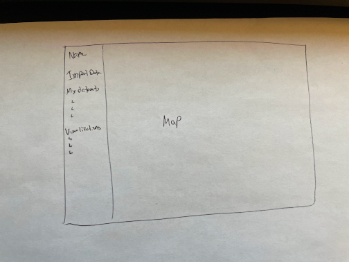

Sprint 2 (2022 Nov 07th*)
=========================
Our second sprint involves finishing the minimum viable product, and ensuring that the product works for every person involved in production and development. As of now, there are a few loose ends to handle especially in regards to local development versus Docker-based development, and the proposal of linting and schema design.

The meeting notes will be listed on the root directory along with the Sprint 2 outline.

Oct 18, 2022 18:00 (Blameless Postmortem)
-----------------------------------------
* Discussed Monday's lecture
* Go over the A2 assignment description
    * We want to have our Docker working properly
* What goals have been achieved?
    * Simple dummy application to build on
    * A rough plan for our milestones
    * Tech stack and reasoning behind each technology planned out
* What goals have been missed, and by how much?
    * The containerization of the application was not met. Instead, we automated using a shell script as a temporary solution
    * Splitting up the work for the milestones among ourselves
    * Project planning board setup. For example, a Kanban board in our GitHub repository.
* How plans will need to be adjusted, based on remaining time available and project scope.
    * The plan is feasible. Additional features were given low priority to ensure we complete the essential features.
* What, if any, adjustments or decisions need to be made in light of what we have learned about project scope and capacity since? 

### Steps to Run
1. Uploading Dataset through React Dashboard which gets stored in SQLite Database
2. how a quick preview 
    * Show the schema
    * Show a couple of rows similar to df.head
    * Show some stats about columns similar to np.describe
3. Visualizations: The user can select what type of visualization (map, etc.) and then click generate which sends a call to the Datasette backend
    * Option to check or uncheck certain columns from appearing in visualization
    * Formatting Data (Modifying SQLite Database): The user can choose to delete certain columns or rows based on the value
    * [Philippe] Layout contains map and sidebar. Sidebar has **My Datasets** and **Visualization**.

Oct 22, 2022 13:00
------------------
### Milestone 2 Recap
Mainly focused on creating a frontend with MVP functionality and providing
a basic mechanism to connect to the backend.

Backend in the current state is quite minimal. Each front end task assigned will be responsible for back end tasks.

For task #4, we can create the functionality, however, the won’t be a UI until we have task 2 completed. Reuse part of the quick preview ui to show the entire database. #4 to be assigned in the future. 

### Backend Status
**Nonfunctional; need further work**

### Roles
Piyush to work on React Dashboard UI and the upload button to store the dataset in an SQLite database.

Philippe to work on the visualizations. Philippe to decide which additional visualizations to add 

Mack to work on the frontend and deciding points to connect to the backend. Backend drafts such as the schema will be made.

Should column column deletion based on nulling. For UI, we can accommodate nulls by not showing them (or using a counter)

### Issues
Due to midterms, we may need to delay working until Wednesday. I will handle the current case, such as Figma.

Oct 22, 2022 22:00
------------------
Review on our current code. The frontend and Docker skeleton was currently incomplete.

Oct 31, 2022 18:00
------------------
Updated `README.md` for  the Docker file [Philippe]. The skeleton backend was pushed [Philippe, Piyush]. Took notes on project risk management, issues, problems, and priority of problems [Mack]. 

### Meeting Proposal:
We decided to visit at 22:00 on a daily basis for 15 minutes. [Happened around 60% of the time]

Nov 01, 2022 22:20
------------------
### Piyush:
* Docker done

### Mack: 
* Tested Docker on Linux
* Made considerations of Github Actions after looking at documentation.
* Python unit tests (no PyTest)
* Set up Docker container.
* Madde Python linter

### Philippe: 
* Need to study the UI maps.

### Proposal: 
Entity-Relation diagram to organize our dataset and to identify which parts require particular analysis. We need to consider how crime data will work and the sources of the crime data. Pick that specific dataset rather than blindly choose which dataset to use. How can this dataset be generalized?

Nov 02, 2022 22:00
------------------
### Readme:
* Discussed that docker image is good information. We will eliminate the exact package count. Mack has added a trace of a successful Docker run on Linux.

### Piyush Tomorrow:
* Flask and available data
* How proper pull request should work

### Mack Tomorrow:
* Minimal RE diagram + Skeleton Yaml File

Nov 03. 2022 22:20
------------------
### Piyush: 
* Finished the frontend. Needs to do the backend, uploading the files.
### Philippe: 
* Got the map working, except for those in Washington
### Mack: 
* Get GitHub actions working

Nov 04, 2022 22:00
-----------------
We have combined the branch, related to the static directory and the flask server.

### Issues:
* Map data not set correctly (404 error)
    * Fixed that on Docker [Philippe]
* Made changes to the Dockerfile [Philippe]
* Need to install the CORS library using pip install

### Review process:
It has been decided that only one person is required to approve for the pull request to be effective.

### Mack:
Approved the changes from the mulliganaceous-patch branch.
Mack will have to prepare for a major second-round interview from Intel. Talked to Michael Hoye at 15:00.

### TODO:
* MyDatasets Tab and Github Actions (Mack)
* Schema (Mack)
* A2 Writeup (Submit by Sunday, finalize by Monday)

Nov 07, 2022 13:00
------------------
Mack has completed his Intel interview, on a reinstalled Ubuntu machine. He has not encountered any difficulties on his technical part of the interview.

Nov 10, 2022 12:00
------------------
Mack has received a possibly early rejection notice from Intel.

Nov 12, 2022 22:15
------------------
Mack has discussed with the team members in regard to the extension. The extension can go up to Monday, in which grading will start. Mack has had trouble with Node.js recently, and has trouble fixing it even with the assistance of his intern manager (he is currently also working on an internship assignment). The source has to do with dependency conflicts, broken packages, and not being run sudo node. He will continue to fix the loose ends shortly before the hard deadline.

Nov 13, 2022 22:04
------------------
Participants: Mack, Philippe, Piyush (22:10)

I have pinned the Docs for the notes and for the A2. Mack will be the principal notetaker for the remaining meetings. He has read through Software Engineering: Theory and Practice by Shari Lawrence Pfleeger. After reading this textbook, he has a clearer idea on proposing which technologies are to use.

Tonight, we pointed out the last remaining parts of our writeup, provided documentation on how to run the application, both on Docker and locally, and listed the nine major risks of development.

Mack will work on the remaining goals for A2 that was missing, including the My Datasets tab, while the remaining two will work on the README.md for local and Docker development.