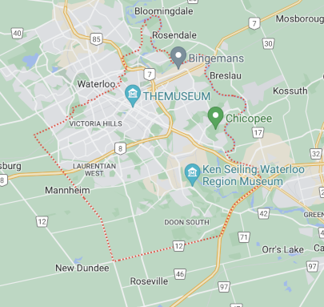
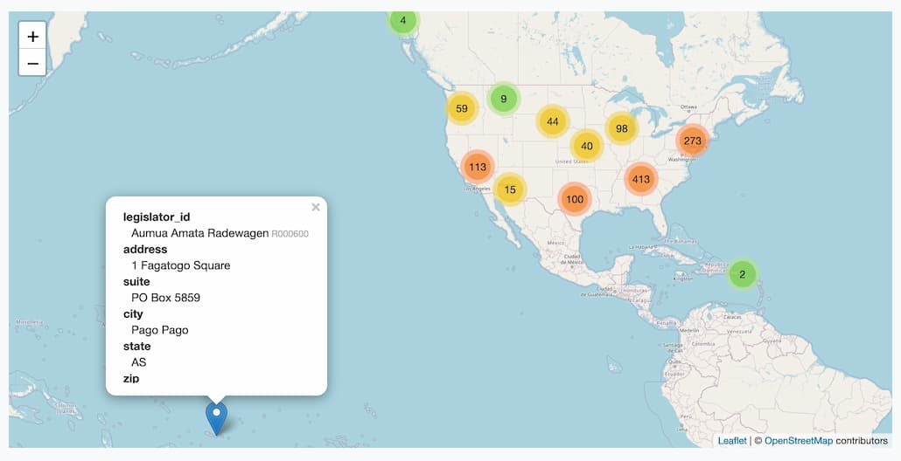
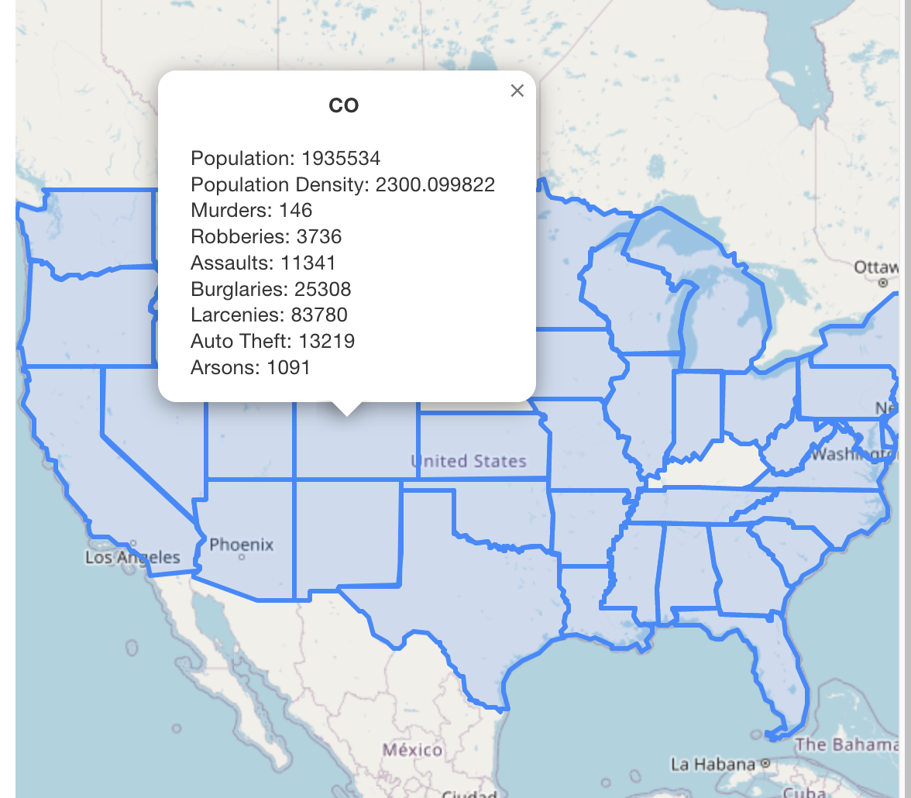
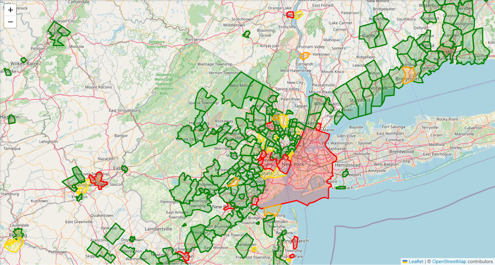
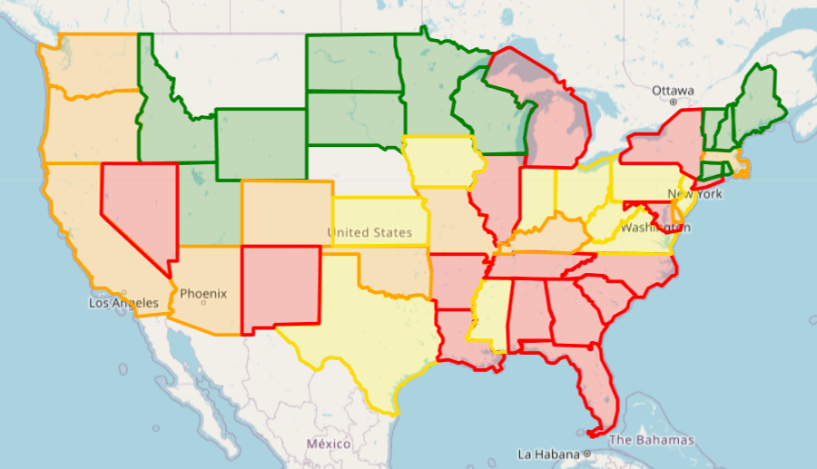
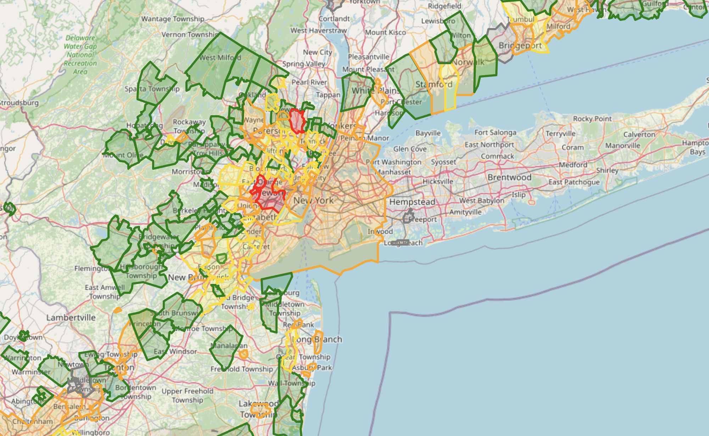
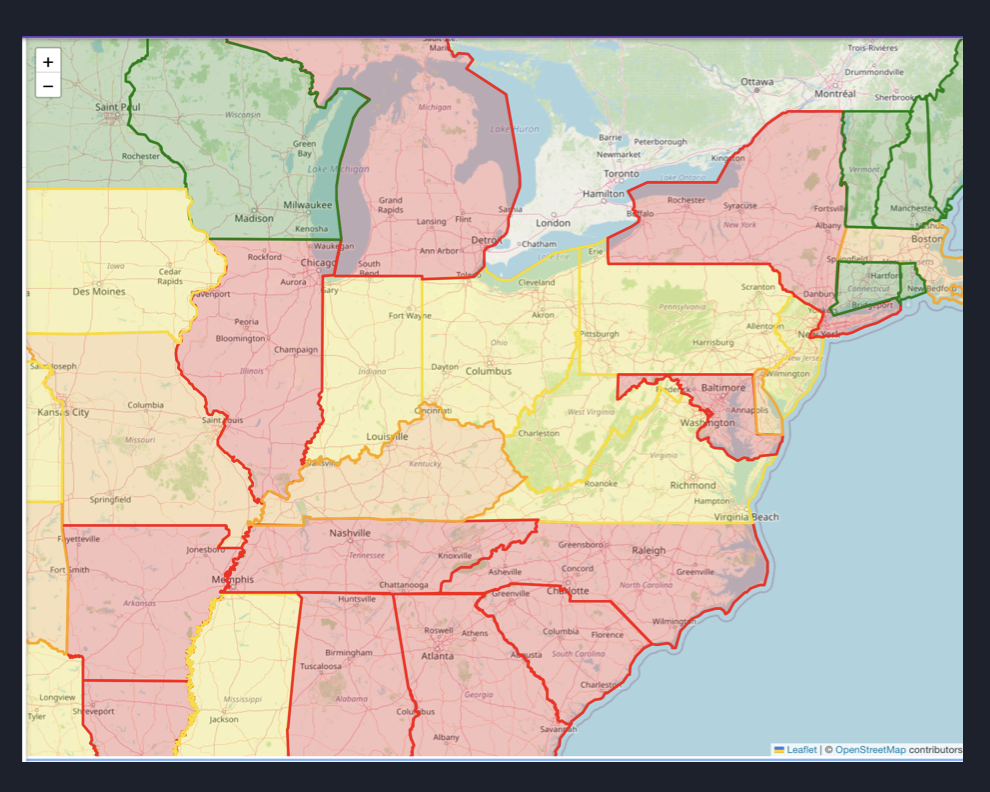

Sprint 3 (2022 Dec 09th*)
=========================
The purpose of this short one-week session is to recoup our loss for Sprint 2. So far, I saw a **14 out of 20**, so we got a 70%. We need to discuss with Michael Hoye to prove we have recouped our losses and are now back on track. The reason is that there are major difficulties. Furthermore, our image is too big simply from running SQLite.

Major Issues
------------
The staff pointed out four aspects of failures which led to lost progress for A2.

* Image is too bulky for just running sql-lite, please consider revisiting the packages listed as dependencies for the container
    * Identify NPM dependencies
    * ETC: 2 days
* Installation eventually succeeds, albeit with a lot of warnings.
    * We need to make considerations of the warnings.
    * ETC: 2 days
* Backend status is non-functional. We need a functional backend at this stage of assignment.
    * This is something we missed. We need to research more on backend.
    * ETC: 5 days
* Test fails since it is not able to query the backend database.

Sun Nov 20th, 2022 19:45 ~ 20:45
--------------------------------
At the time of installation, Docker is no longer usable. We are using MUI, React Router, and React Native. We do not know what is causing the anomalous behavior, so we have to investigate.

### Urgent
Due to Docker issues, we need to discuss more regarding the Docker installation.
We need to clarify Docker installation. How can you prove the backend is functional? It serves frontend, and responds to frontend API.

Mack tested locally, and it is not working. I am not able to get the backend working after installing the frontend. Falcon is a Mac, Piyush is a Windows, and Mac is a Linux!

### Sprint III Meeting Times:
* Extended discussions are conducted for new ideas, overall progress and journaling, and trying out our program. 
    * It should last at least an hour and there should be an agenda.
    * Saturday and Sunday evenings and nights are the best place for extended discussion. They are done online.
* Scrums are conducted every business day. It is a report on what updates and difficulties one have encountered.
    * After running scrums on 22:00, we later moved to 21:00.
    * We will now move the scrum earlier to 19:00. They are done online. [Missed a week]
* In-person meetings are done occasionally and are conducted based on common in-person events and critical issues.
* A possible time is in-person this Thursday 7pm. [Cancelled]

### This week’s schedule:
* Falcon
    * TBA
* Piyush
    * Can work on this project any time this week that isn’t 10am to 4pm Thursday and 1pm to 2pm Friday.
* Mack
    * Will dedicate full time on this project from Wednesday to recoup
    * Taking a lighter course load as well

### Projected Goal
We need to show beforehand that our Docker is working, and identify installation instructions and subtleties we missed upon installation. We have to identify why people are complaining about the troubles they are seeing.
Deadline: Nov 22

### Testing and Automation
Due to previous issues, it is hard for Mack to continue testing our app. We will carry on testing and automation throughout A3, in which logging will also be combined with testing.

### Workflow
We will propose that our development branches will update.

    Master ---------- Master ---------------------- A3
    \                / \
     \              /   \ - Feature branches…
      \            /     \
       - A2_Patch -       - Feature branches…

Blameless Postmortem (Assignment 3)
-----------------------------------
### What goals have been achieved?
*   React Dashboard setup
*   Flask backend setup
*   Import Dataset functionality
*   Map visualization functionality
*   Docker containerization setup

### What goals have been missed, and by how much?
*   My Datasets tab: Viewing list of currently imported datasets and their schemas
*   Testing: Need to do this on both frontend (Jest) and backend (Python Unit tests)
*   Automated Testing: GitHub Actions integration

### How plans were adjusted, in light of that information, including goals or features that were dropped, what other changes were made and why?
*   My Datasets tab, testing, and GitHub Actions will be carried over from A2 to A3 due to teammate's external commitments.

A3 Work: Look into accuracy of reverse geolocation
--------------------------------------------------
Piyush
    * Improving Dashboard UI [+]
    * Adding more options for Importing Datasets as mentioned in A2 Writeup [+]
    * Formatting Dataset (CRUD operations) [+]
    * Visualization Selector: Adding options for Visualizations (Collaborate with Philippe) [-]

Philippe
    * Reverse geolocation fix [+]
    * Map boundaries [+]
    * Improve data ingestion workflow [+]
        * When dataset is submitted, export the server response immediately and cache it
        * If modifications are made to a dataset, update the cached version
        * This will create a much more responsive website
    * Live data (stretch goal) [-]
        * Find a way to scrape data from https://twitter.com/TPSOperations
        * Take intersections and add those as points on the map
        * Live data can be used to update current backend

Mack
    * Logging, Testing, Automation [+]
    * My Datasets tab: Getting Datasets list and Displaying Schemas [+]
    * Sorting data by crime type [+]
        * Data can be color coded to identify crime hotspots
        * Crime hotspots helps us identify where the crime is frequent in and causes of crime.
        * Total crime
    * Filtering crime type [+]
        * Felonies vs Misdemeanors
        * Allow user to filter the dataset by columns and values (essentially not have the user write SQL, but rather let them filter using a React form)

Sun Nov 27th
------------
After a week-long drought, Philippe utilized openstreetmap.
> figured out how to add the boundary maps to each county, openstreetmap gives us the data and the map library will let us easily shade the area. We stated that Node 18 is required, since apt Node uses Node 12.

### Regrade Request for A2
After receiving a grade of 70%, Philippe commented
* The source of the size of the image
* Installation with many warnings
* Nonfunctional backend

### Piyush
> I haven't been able to do much work on my part yet because I have a lot of assignments and I have a midterm tomorrow morning. After my midterm tomorrow, I'll be able to work on the project

Mon Nov 28th 22:03 ~ 22:16
--------------------------
Our map was implemented.

### Issue: Process Time
Data takes a really long time to process. The api we are using, **openstreetmap Nominatim** is rate limited to 1 request per second. Our dataset is very large, so processing all that data will take several hours. Mack to propose that caching is the solution.

As this takes a long time, we will need to cache our results. Provide a sample .db or .csv that can be used to create our data. 

Data ingestion method will be as follows: 
1. Receive csv
2. Transform to sqlite db
3. Make appropriate requests from Open Street Map
    * modify sqlite database to have that information
4. Serve requests by outputting db in json format.

### Issue: Incorrect City Shapes
Data from that api is not always correctly formed, for example lat and long are sometimes swapped, city names do not exist, etc. 

Was able to detect swapped lat and long, but for city names that don’t exist, we will have to leave that out of our dataset. Philippe to use json.parse to take in geogjson data in the frontend. 

Unit tests should ensure the validity of our datasets.

Tue Nov 29th
------------
Revisions to code was made to add functionality to My Datasets and preventing mismatching ports.

### Mack
Mack is experiencing issues with communicating with the backend from the frontend.

* Issue is due to port differences. Mack was running the backend on port 5000 when the frontend makes a request to port 3000.
* Discussed changes to the mapData api endpoint. Mack will need to add dbname endpoint to his requests to mapData. The `@cross_origin()` was added to all routes to prevent CORS issues.
* It is decided that the backend will use Port 3000.

### GitHub Actions
Github actions revamped; still in progress

Wed Nov 30th 20:23 ~ 22:51
--------------------------
### Improved Dataset Importer
    * Improved Dataset Importer Tab UI
    * Added support for uploading multiple files and excel files. Supported file types are .csv and .xlsx
    * Added support for drag-and-drop file upload
    * Status of the file upload is shown along with the file names and their respective file icons based on file type
    * Fixed bug in Flask backend where filenames with whitespace produce an error

### Mack
Rudimentary My Datasets was converted to unformatted table form. It was commented to have "no use to the user." Logo temporarily changed.

Piyush pointed out that
> I realized you will also need to add a dropdown selector on the Visualize tab so the user can pick which dataset they want to visualize

Thu Dec 01st 21:43 ~ 25:01
--------------------------
### Port confusion
There has been some confusion about which app to use. According to Philippe:
> Frontend is port 3000 if you want to get the release version / 3001 if you're running react on your machine

### Piyush: UI
Worked on UI changes for the dashboard. Proposals include
* Better theme
* Header bar with tab title
* Dark mode switch

### Philippe, Mack: Zoom and State Level
* Made additional changes to the map and backend handling
    * If user zooms out, they get state data
    * If user zooms in,, they get city data
    * Boundary and polygons are in a JSON, outside the .csv source file
    * Requires major changes to the backend. The dataset name must be passed to the My Datasets tab as a prop.

### Mack: My Datasets
* Tab completed, showing all of the required fields displayed in a table. More improvements are required.
    * Mack and Philippe conducted code review on Mack’s pull request. 
    * A rudimentary my-datasets tab was merged into master.

> @Philippe can we have a quick call tomorrow at whatever time works for you so you can explain the Map code to me. I'm a bit confused on how to modify the popups for each location in the map (so I can add my statistics to these) and also what the best way to work with the location data is when I'm calculating these statistics

Thu Dec 01st 01:48X ~ 02:48X
----------------------------
An overnight discussion regarding the implementation of multiselect. It is expected to take 24 manhours to implement. 

Presentation slides are prepared,

Fri Dec 02nd
------------
Mack will be at Bahen this day.

### Philippe: GeoJSON
Some cities have multiple disconnected or multiply connected regions. The GeoJSON then will return multipolygons.

### Tests
* Github partially functional github actions were merged into master. 
* The docker test is passing
* Python unit tests are not functional at this time as Mack has not written them.

### Multiselection
The design of how to detect new databases was discussed. Mack will create a new endpoint that runs ls in the database folder and returns the result.

### Bahen
Neither Mack nor Philippe were able to run the app, either on the Debian platform or on the Ubuntu VM.

The final days
--------------
### Agenda I
- Merging in finished My Datasets tab and Visualization Selector 
- Ensuring testing suite is complete and all tests pass 
- Ensuring Docker and GitHub actions pipeline are running successfully 
- Creating a template of our presentation and assigning slides 

### Agenda II
- Merging in finished My Datasets tab and Visualization Selector
- Ensuring testing suite is complete and all tests pass
- Ensuring Docker and GitHub actions pipeline are running successfully
- Creating a template of our presentation and assigning slides 

### Slide Template
Decided the following slides will be made
    * Dataset/Problem we chose
    * Solution we chose to develop (visualization dashboard)
    * Tech stack
    * Sprints overview
    * Demo
    * Technical Challenges, Solutions, and Considerations
    * Future improvements

Demo will be a screenshare, ~1 minute

* Philippe will be responsible for 
    * Demo
    * Technical challenges and solutions regarding the map
    * Sprints overview

* Mack will be responsible for 
    * Technical challenges, solutions, and considerations, 
    * Future improvements

* Piyush will be responsible for 
    * Dataset/Problem we chose, solution we chose to develop
    * Tech stack.

Sat Dec 03nd 12:16 ~ 14:06
--------------------------
The heatmap implementation was done. Considerations have to be made to handle consolidated and non-consolidated cities.

### Heatmap
Philippe has completed the heatmap for both state and city level data.
The heatmap calculation is currently hardcoded. [14:05]

Sat Dec 03nd 20:00 ~ 23:53
--------------------------
On that penultimate day, we decided to simply the process of running Flask. Flask will always run on Port 3000, leaving the front end to run on another port, say 3001.

### Multiselect
Database files, generated by the backend after import now go to the `db/` file on the backend folder, still named `/scripts/` from root. GitHub actions further revised.

Sun Dec 04th
------------
No activity

Mon Dec 05th
------------
First batch of presentations

Wed Dec 07th
------------
As the instructor changed the presentation deadline to Dec 8, the full runthrough scheduled for Dec 4 was moved. Bug reports, My Dataset organization, and the flow of data has been finalized by Mack, where the branch structure is as follows

    ------------------------------------------------------------ A3
                                                             |
    Multiselect ------------------------------ Multiselect --|
                  |                        |
                  |---- Backendpoint ------|
                  |                        |
                  |---- Mydatasettable ----|
### Unit tests
Mack was not able to develop any unit tests
Philippe discussed online with Mack and took the python unit test task over. Philippe was able to write some unit tests ensuring the validity of the data ingestion portion. The unit tests are passing and there is a green checkmark on github.

### Multiselect
There were several bugs introduced in Mack’s latest pull request.
*   The map view would load several datasets at the same time erroneously.
*   The map view showed state and city data at the same time preventing city data from interactions.
*   The heatmap thresholds were modified causing areas of high crime to be marked as less crime. 
*   The violent crime calculations were modified to include non-violent crime.
*   A new heatmap color of gray was added for missing data.

We discussed the issues that needed to be fixed. Mack will revert the heatmap changes, fix other bugs. Mack said the pull request will be merged tomorrow. Mack will work on his slides as well.

Mack has spent a **considerable amount of time** that night to examine the remaining bugs in regard to multiselect and multiple uploads. All logging has been finished at that point. A short meeting was conducted around midnight.

A rehearsal is scheduled for tomorrow (december 8) starting at noon.

Thu Dec 08th (I) 12:00 ~ 15:00
--------------------------
This was six hours before presentation.

### Agenda:
    * Merge Mack’s pull request
    * Rehearse for the presentation

### Issues
Mack was not present for the scheduled meeting. Philippe and Piyush reviewed Mack’s pull request. The heatmap changes were not reverted. The file structure was changed causing unit tests to fail.

Philippe and Piyush worked to fix these issues and were able to merge the pull request. As Mack was not responding to messages, a rehearsal was done. Piyush agreed to take over Mack’s part of the presentation if he did not attend.

Some suggestions were made to improve the slides, the slide order was reorganized.

Another meeting will be scheduled later today if Mack becomes available. [+]

Thu Dec 08th (II) 15:00 ~ 18:00
-------------------------------
### Agenda:
    * Rehearse the presentation [thrice]
    * Last minute changes if required

Mack responded to messages and was available for a rehearsal at 15:00
Multiple rehearsals were conducted, some suggestions were made to improve Mack’s part. Mack provided a script.

Slides were finalized. There were some issues regarding the technical challenges done last minute before Mack have to stop.